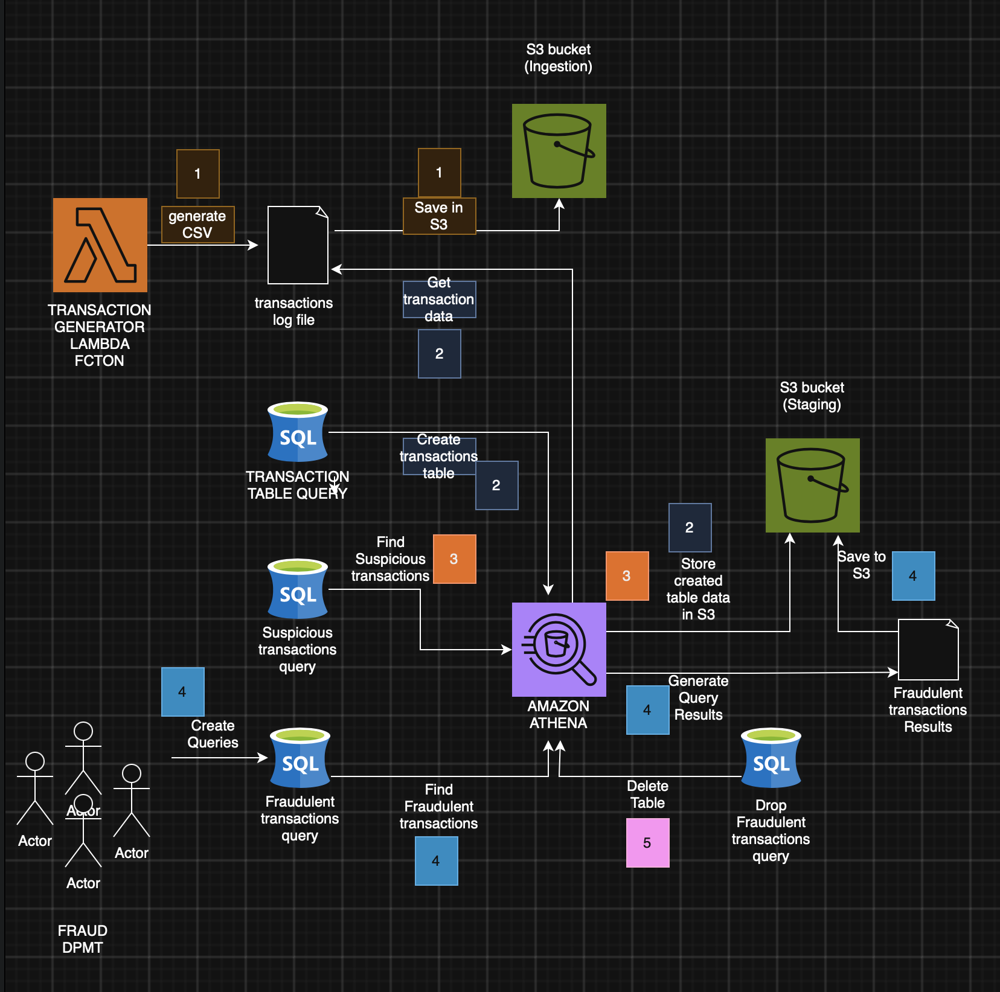

# Amazon Athena Credit Card Fraud Detection

## Overview

Built a serverless data analytics workflow using **AWS Lambda, Amazon S3, and Amazon Athena** to ingest and analyze simulated credit card transaction data and identify potentially suspicious activity.

## Architecture

**AWS Lambda → Amazon S3 → Amazon Athena → SQL Analysis**

* **AWS Lambda** generates simulated credit card transaction data.
* **Amazon S3** stores the transaction files as the data lake.
* **Amazon Athena** queries the data directly from S3 using SQL.
* SQL queries identify transactions matching potential fraud indicators.
* Athena stores query results in S3 for further analysis.

## What I Built

* Generated simulated credit card transaction data using AWS Lambda.
* Created an Amazon Athena table using data stored in S3.
* Queried transaction data using SQL to identify potentially suspicious transactions.
* Configured and reviewed Athena query-result locations in S3.
* Used a serverless architecture without managing database infrastructure.

## Technologies

**AWS Lambda · Amazon S3 · Amazon Athena · SQL · Python**

## Key Takeaway

This project demonstrates how a serverless AWS data lake architecture can be used to **store, query, and analyze large volumes of transactional data without requiring a traditional database infrastructure**.

